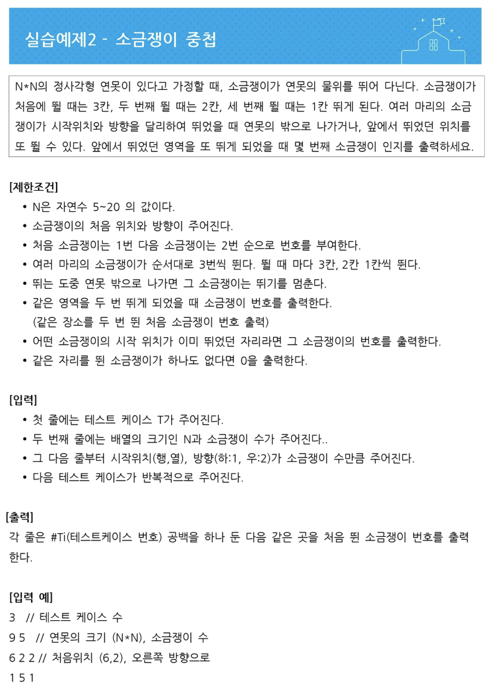

## 소금쟁이 문제

<!-- .element height="50%" width="50%" -->

```java
package basicjava;
import java.util.Scanner;

public class Salt {
	public static void main(String[] args) {
		Scanner sc = new Scanner(System.in);
		int t = sc.nextInt();
		int[] xx = new int[t];
		
		for (int x = 0;x<t;x++){
			int s = sc.nextInt(); int n = sc.nextInt();
			int[][] map = new int[s][s];
			boolean flag=false;
			for (int i=0;i<n;i++){
				int width = sc.nextInt();
				int height = sc.nextInt();
				int way = sc.nextInt();
				if (flag==true){
					continue;
				}
				
				else if (way==1){
					for (int j=1;j<=4;j++){
						if (width >=s ){
							break;
						}
						if (map[width][height]==1){
							xx[x]=(i+1);
							flag=true;
							break;
						}
						map[width][height]=1;
						width=width+(4-j);
					}
				}
				else if (way==2){
					for (int j=1;j<=4;j++){
						if (height>=s){
							break;
						}
						if (map[width][height]==1){
							xx[x]=(i+1);
							flag=true;
							break;
						}
						map[width][height]=1;
						height=height+(4-j);
					}
				}
			}
			if (!flag){
				xx[x]=0;
			}
		}
		sc.close();
		for (int x=0;x<t;x++){
			System.out.println((x+1)+" "+xx[x]);
		}
	}
}
```

