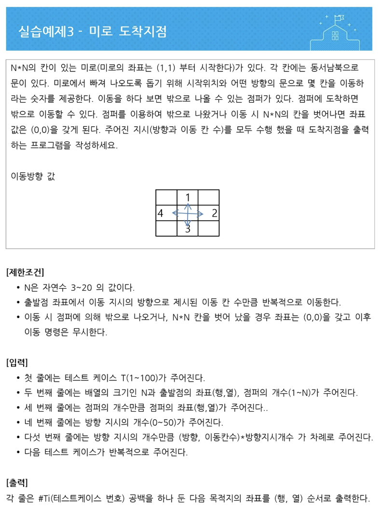

## 미로 문제



```java
package basicjava;
import java.util.Scanner;

public class Maze {
	public static void main (String[] args){
		Scanner sc = new Scanner(System.in);
		int t = sc.nextInt();
		int [] answers = new int [t*2];
		
		for (int i=1;i<=t;i++){
			int n = sc.nextInt();
			int x = sc.nextInt();
			int y = sc.nextInt();
			int j = sc.nextInt();
			int [] jumpers = new int[2*j];
			for (int a = 1;a<=j;a++){
				jumpers[2*a-2]=sc.nextInt();
				jumpers[2*a-1]=sc.nextInt();
			}
			int turn = sc.nextInt();
			boolean flag=false;
			for (int b = 1;b<=turn;b++){
				int way = sc.nextInt();
				int step = sc.nextInt();
				if(way==1){
					x = x-step;
				}
				else if(way==2){
					y= y + step;
				}
				else if(way==3){
					x = x+step;
				}
				else{
					y=y-step;
				}
				if (x<1 || x>n || y<1 || y>n){
					answers[2*i-2]=0;
					answers[2*i-1]=0;
					flag=true;
					break;
				}
				for (int c = 1;c<=j;c++){
					if(x==jumpers[2*c-2] && y == jumpers[2*c-1]){
						answers[2*i-2]=0;
						answers[2*i-1]=0;
						flag=true;
						break;
					}
				}
				if (flag){
					break;
				}
			}
			if (!flag){
				answers[2*i-2]=x;
				answers[2*i-1]=y;
			}
		}
		sc.close();
		for (int x=0;x<t;x++){
			System.out.println((x+1)+" "+ answers[2*x]+" "+answers[2*x+1]);
		}
	}
}
```

